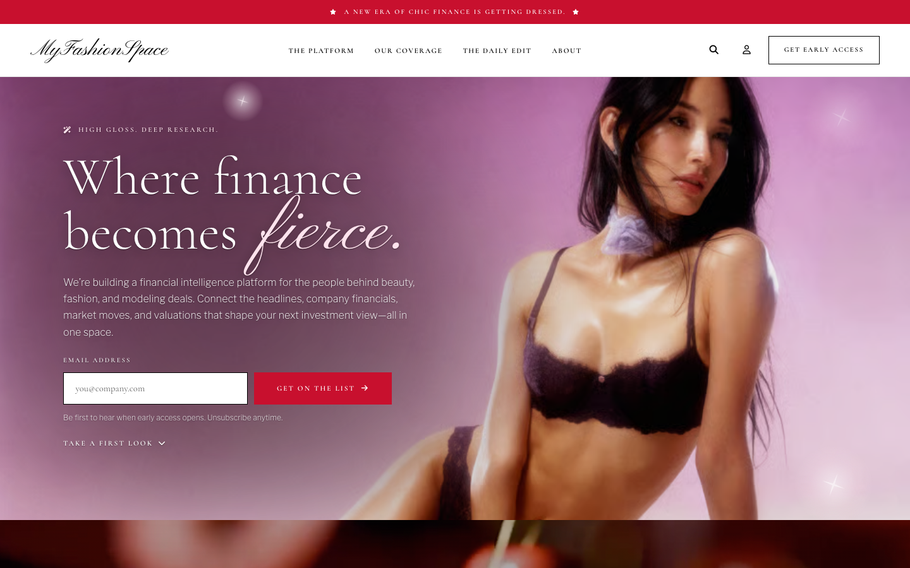
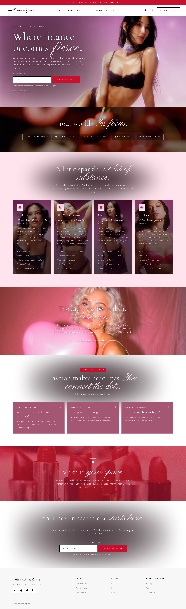
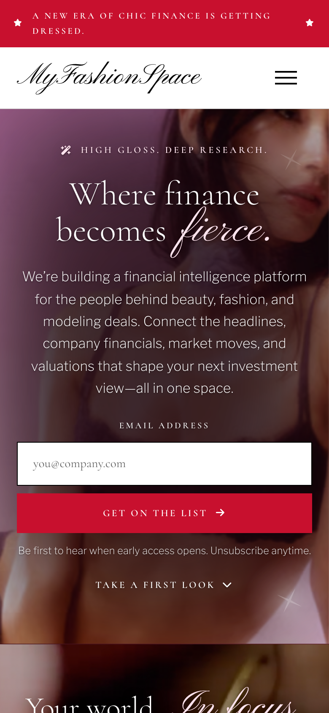
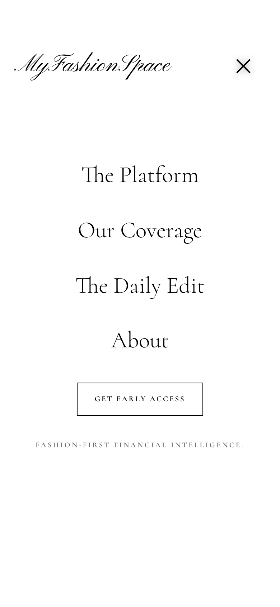
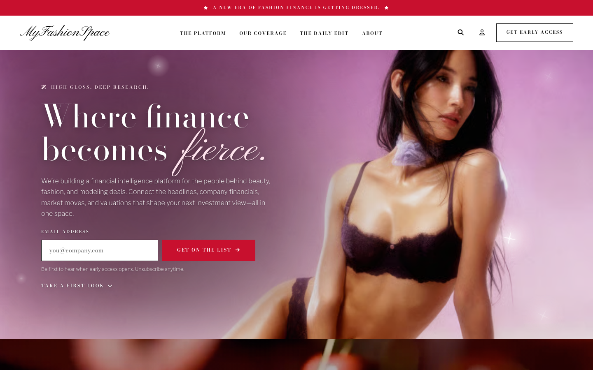
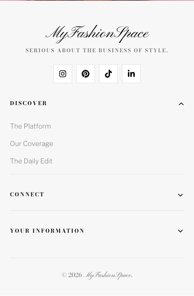
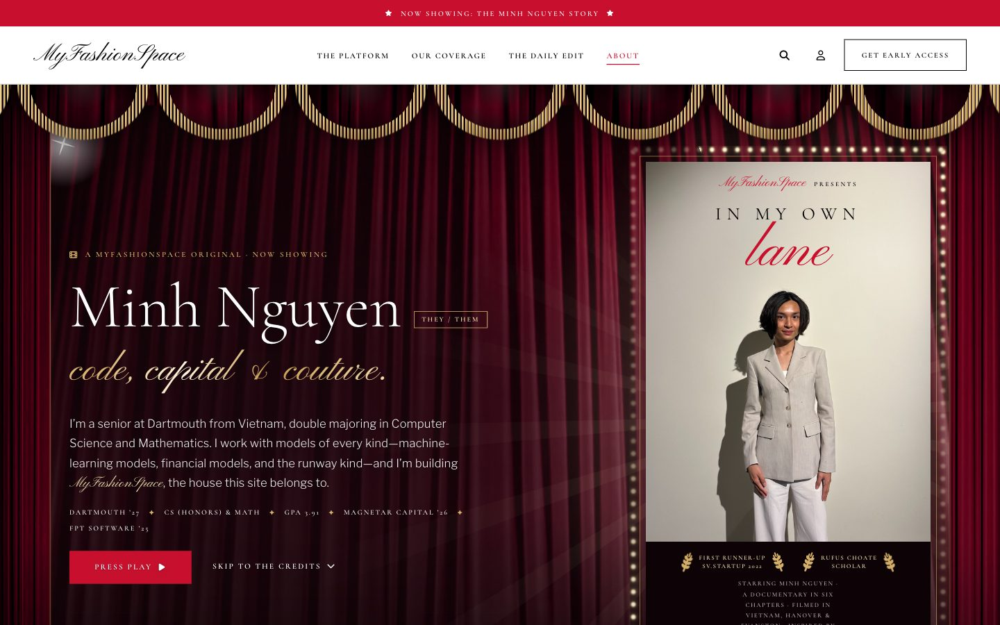
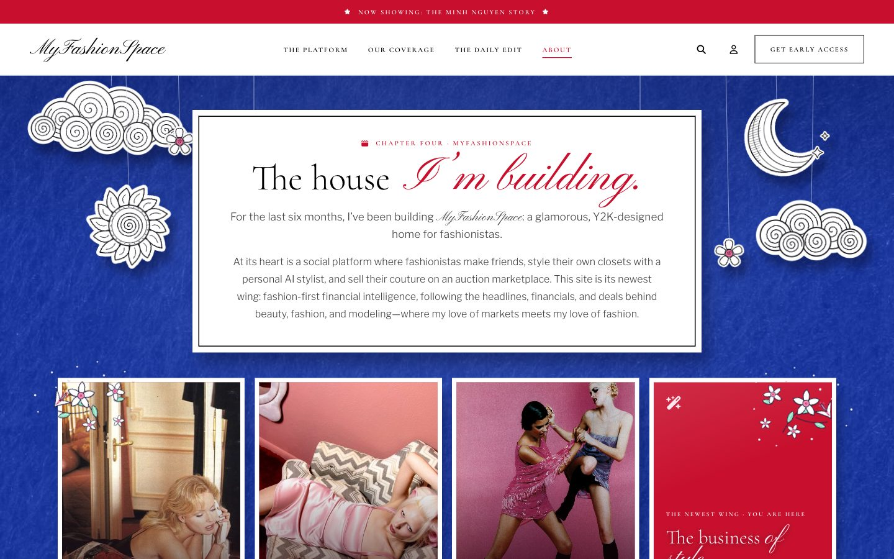
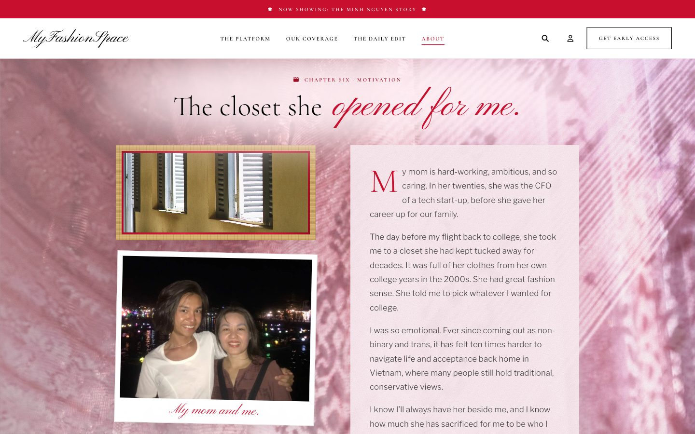
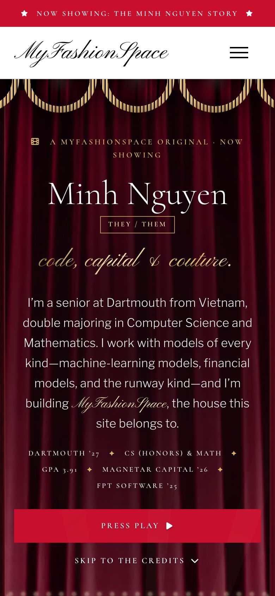

# MyFashionSpace — Landing Page & About

A static HTML/CSS site for **MyFashionSpace**. It has two pages:

- **`index.html` — the landing page** for an imagined early-access financial-intelligence platform for the business of beauty, fashion, and modeling. It mimics both the structure and the styling of the Victoria's Secret storefronts — a white page with black type, blush `#FFE3ED` color blocks, crimson `#C8102E` actions, square corners and small uppercase letterspaced labels — but with entirely original content.
- **`about.html` — the About page**, reached from "About" in the nav, the mobile menu and the footer. It is my personal site, told as a documentary: *In My Own Lane: the Minh Nguyen story*.

Both pages are hand-written HTML and CSS only: no JavaScript, no frameworks. Layout is flexbox throughout, with a single 640px breakpoint for phones and the pure-CSS checkbox hack driving the hamburger menu and the expanding footer sections. The landing page's backdrop and campaign images are animated from inside their own SVG files, so the page keeps moving without a line of script.

## Screenshots

### Landing page

Desktop hero:



The whole page:



Phone width, and the hamburger overlay opened with the CSS checkbox hack:

| Mobile | Menu open |
| --- | --- |
|  |  |

A few details worth pointing out:

| | |
| --- | --- |
|  | Three of the twelve glints mid-flash. They fire on separate clocks, so the hero never repeats the same frame. |
|  | The hover glare, color-matched: this control is crimson, so the light it throws is crimson. |
|  | The footer headings expand on tap at phone width — checkbox hack, no JavaScript. |

The unstyled Part 1 structure, for comparison, is in [`html-screencap/`](html-screencap/).

### About page

| | |
| --- | --- |
|  | **The premiere.** My cover photo as a film poster, ringed by marquee bulbs, in front of a real velvet curtain that parts when the page loads. |
|  | **Chapter Four, "The house I'm building."** A pop-art paper set on cobalt, with hand-drawn cut-outs hanging on strings. |
|  | **Chapter Six, "The closet she opened for me."** The lace holds still while the chapter scrolls over it, like the landing page's pinned runway shot. |
|  | **Phone width.** The same single 640px breakpoint as the landing page. |

## The About page

### Structure

The page is a documentary in six chapters. Every chapter sits on a real, softly graded photograph or material, and each has its own "film stock":

| Section | What it covers | What it sits on |
| --- | --- | --- |
| Premiere | Name, pronouns (they/them), a short intro, credentials, the film poster | Real red velvet curtains and a gold swag valance, marquee bulbs, projector rays, camera-flash glints |
| Scene selection | A 2000s DVD-style chapter menu (the table of contents) | A pinned vintage film reel |
| Prologue | "Hi, I'm Minh." — who I am, a polaroid and a subject file | A blue-and-white porcelain still, two 1990s magazine pages, and a Nguyễn-dynasty lotus embroidery printed faintly behind the letter inside 1919 Huế floral corners |
| Chapter One — Built for people | Signtegrate, Dartmouth patient-access research, FPT Software | A faded encaustic cement-tile (gạch bông) floor and 35mm negatives |
| By the numbers | Four figures in Bodoni numerals that count up as they scroll in | Red sequins |
| Chapter Two — Follow the money | Tuck Business Bridge (AECOM valuation), Magnetar Capital | A pinned Gilded-Age banking hall |
| Chapter Three — Beauty pays the bills | My notes on fashion and beauty M&A and credit | A pinned old perfumery counter, shot on film, with the notes framed as deal tombstones |
| Chapter Four — The house I'm building | MyFashionSpace | A pop-art paper set on cobalt |
| Chapter Five — Out, and all in | Community and leadership | A mirror ball |
| Chapter Six — The closet she opened for me | My mom | Pinned lace, window light and louvered shutters |
| Epilogue — In my own lane | What's next, and what I bring to the table | An ornate runway hall; runway footage plays behind the "What I bring" table |
| Credits | Skills, honors, photo credits and contact | Empty cinema seats |

### Files

- `about.html` — the page. It reuses the landing page's header and footer, pointed back at `index.html#…`.
- `about.css` — loaded after `style.css`, which it leaves untouched. Colors, type and controls come from the landing page's tokens.
- `img/about/` — web-sized copies of my photos (rotation baked in, all camera metadata such as GPS stripped), plus two background plates, `lace.jpg` and `seats.jpg`.
- `img/about/bg/` — the background plates, the hand-drawn SVG cut-outs and doodles, and the runway footage as a sprite sheet.

The full-resolution originals of my photos stay out of the repository (see `.gitignore`).

### Techniques

- **Pinned backgrounds.** Several sections use the landing page's own technique: a `position: fixed` layer inside a section with `clip-path: inset(0)`, so the photo holds still while the content scrolls over it. Unlike `background-attachment: fixed`, this also works on iPhones.
- **Scroll-driven entrances.** Headings, cards and photos rise or open from a letterbox as they enter the viewport, using `animation-timeline: view()`. The effect is gated behind `@supports` and `prefers-reduced-motion: no-preference`, so browsers without it simply show everything in place.
- **Count-up numerals.** The numbers band animates a registered `@property` integer into a CSS counter. The written figure stays in the markup for screen readers.
- **The runway footage.** A Victoria's Secret Fashion Show clip from my mood board is stored as a 9-frame sprite sheet (`img/about/bg/runway-sprite.jpg`, 500×212 frames stacked vertically) and plays behind the "What I bring to the table" grid. It steps through the frames with `steps(9, jump-none)` at 210 ms a frame, a touch slower than the clip's own 140 ms, and `runway-still.jpg` stands in under reduced motion.
- **Stage dressing.** The curtains part by scaling from their outer edges, so the folds gather rather than slide. A conic-gradient mask sends a bright stretch chasing round the marquee bulbs. Film grain is an inline SVG `feTurbulence` data URI, so no image is loaded for it.
- **Motion.** Every animation respects `prefers-reduced-motion`, through the landing page's global kill-switch plus the gates above.

### Type

The landing page's stack is Cormorant for display, Libre Franklin for running copy and Pinyon Script for accents. The About page adds one guest face, [Bodoni Moda](https://fonts.google.com/specimen/Bodoni+Moda), a Didone used for the marquee numerals.

## Setup

This is a plain HTML/CSS site with no build step and no dependencies to install for the site itself. To view it:

1. Clone/open this repo.
2. Open `index.html` (or `about.html`) directly in a browser (double-click it, or `open index.html` on macOS), or serve the folder with any static file server, e.g. `npx serve .` or `python3 -m http.server`.

`npm install` is only needed inside `tests/`, for the structural test suite — see "Running the provided tests" below.

## Deployment

Deployed with GitHub Pages from the `main` branch of this repository, on the custom domain in [`CNAME`](CNAME):

- **https://emilyng.me/** — the landing page
- **https://emilyng.me/about.html** — the About page

https://minh-nguyen-2005.github.io/ redirects to the custom domain. The original CS 52 lab version was deployed at https://dartmouth-cs52.github.io/lab1-landing-page-Minh-Nguyen-2005/.

## Acknowledgments

- **Content:** All landing-page copy comes from the provided content handoff, [`MyFashionSpace-Landing-Page-Content.md`](MyFashionSpace-Landing-Page-Content.md). The About page's copy is my own story and CV, in my own voice; Chapter Three's market notes are built from public sources only.
- **Structural and visual inspiration:** [Victoria’s Secret US](https://www.victoriassecret.com/us/) and [Victoria’s Secret UK](https://www.victoriassecret.co.uk/). Two things were taken from them. The structural rhythm — promo strip → nav → hero + email capture → grouped feature links → footer. And the visual system, read off the live UK storefront with browser devtools: the white/black base, the blush `#FFE3ED` panels, the crimson `#C8102E` actions, the square corners and the small uppercase letterspaced labels. No markup or CSS was copied; every rule in `style.css` and `about.css` is written from scratch, and all copy is original.
- **About page references (for mood only; nothing was copied):** ADÉLA's "Nicole Kidman" music video (directed by Hannah Lux Davis), *Moulin Rouge!*, IVY moda's "Girl Over Flowers" collection (2017), Thủy Design House's "Cô Ba Sài Gòn" collection, Tô Ngọc Vân's *Thiếu nữ bên hoa huệ* (Young Woman with Lilies, 1943), 1990s fashion editorials shot in Vietnam, and Old Hollywood glamour.
- **Display type:** the intended face is [IvyOra Display](https://ivyfoundry.com/families/ivyora/) Light, by Jan Maack of [Ivy Foundry](https://ivyfoundry.com/licensing/) and distributed through [Adobe Fonts](https://fonts.adobe.com/fonts/ivyora) and Type Network. It needs a license and so cannot be linked from here. The stack names it first, then falls back to [Cormorant](https://fonts.google.com/specimen/Cormorant) Light from Google Fonts, which is what every visitor sees in practice. IvyOra is a Dutch Old Face revival, so an old-style with fine hairlines and a real 300 sits far closer to it than a Didone would; Cormorant is the display cut of that family, drawn for large sizes, which is what this page uses it for. The IvyOra names are kept at the front of the stack so the real face takes over automatically if it is ever licensed and installed, or served from a web project. To serve IvyOra to everyone, create an Adobe Fonts web project and add its stylesheet link to the `<head>`; no CSS change is needed, since the family is already first in the stack.
- **Body copy:** [Libre Franklin](https://fonts.google.com/specimen/Libre+Franklin) ExtraLight sets the running copy in every section, against the Didone used for headings, navigation and buttons. The About page sets its longer passages one weight up, in Libre Franklin Light.
- **Script accents:** the emphasized phrase in each headline is set in a calligraphic face. The intended face is [Classic Script MN](https://fonts.adobe.com/fonts/classic-script-mn) (Mecanorma Collection, distributed through Adobe Fonts), which needs an Adobe Fonts license and so cannot be linked from here. The stack lists it first, then falls back to [Pinyon Script](https://fonts.google.com/specimen/Pinyon+Script) from Google Fonts, so the real face is used automatically wherever it is installed. To switch fully to Classic Script MN, create an Adobe Fonts web project and add its stylesheet link to the `<head>`.
- **Marquee numerals (About page):** [Bodoni Moda](https://fonts.google.com/specimen/Bodoni+Moda) from Google Fonts.
- **Icons:** [Font Awesome 6 Free](https://fontawesome.com/) via the cdnjs CSS build (the CSS build, not the JS one, so the site stays JavaScript-free).
- **Techniques referenced:** the [CSS-Tricks guide to flexbox](https://css-tricks.com/snippets/css/a-guide-to-flexbox/) for layout properties, and the CSS "checkbox hack" pattern (a hidden `input type="checkbox"` plus a `label`, with `:checked ~ sibling` selectors) for the hamburger overlay and the expanding footer headings — as described in [this CSS-only hamburger menu write-up](https://unused-css.com/blog/css-only-hamburger-menu/). Both were read for the technique; the rules in `style.css` are written from scratch.
- **Images:** every image in the final design is photography, credited below, except the About page's hand-drawn cut-outs and doodles (`img/about/bg/*.svg`), which were drawn for it. Earlier drafts of the landing page used original SVG artwork of mine, which the photographs replaced.
- **Photography — landing page:** the `editorial*` files in [`img/`](img/) are supplied fashion-editorial photographs, not my own work. `editorial0.png` is the hero backdrop, `editorial8.jpg` sits behind the platform section, and `editorial11.png`, `editorial10.png`, `editorial12.png` and `editorial13.jpg` are on the four feature cards. `editorial14.png` is behind the coverage strip, `editorial9.jpeg` behind the modeling spotlight, `editorial2.jpeg` behind both the editorial preview and the closing band, and `editorial6.jpeg` behind the personalize band.
- **Photography — About page:**
  - Photos of me, my Magnetar team, O4U Digital 2025 and my mom are my own (`img/about/magnetar_minh.jpg`, `magnetar_team.jpg`, `minh1.jpg`, `minh2.jpg`, `o4u.jpg`, `mom_me.jpg`).
  - Supplied images: `editorial1.jpg`, `editorial3.jpeg` and `editorial5.jpeg` appear as MyFashionSpace mood imagery. `img/about/lace.jpg` is a crop of `editorial7.jpeg`. `img/about/bg/vn-editorial.jpg` is a crop of a Vietnamese fashion editorial from my mood board, and `img/about/bg/vogue-vietnam.jpg` is a page from Bruce Weber's 1990s Vogue story with Kate Moss in Vietnam. `img/about/bg/runway-sprite.jpg` and `runway-still.jpg` come from the Victoria's Secret Fashion Show clip in `img/victoria's secret.gif`. All rights in both remain with their owners.
  - Stock photography and public-domain art, all under the [Unsplash License](https://unsplash.com/license), the [Pexels License](https://www.pexels.com/license/), CC0 or in the public domain:

    | File (in `img/about/`) | Photographer | Source |
    | --- | --- | --- |
    | `bg/curtain.jpg` | Rob Laughter | [Unsplash](https://unsplash.com/photos/red-theater-curtain-WW1jsInXgwM) |
    | `bg/velvet.jpg` | Liana S | [Unsplash](https://unsplash.com/photos/rich-red-velvet-theater-curtains-with-stage-curtains-nxZ3CK5KTME) |
    | `bg/reel.jpg`, `bg/reel-sm.jpg` | Sami TÜRK | [Pexels](https://www.pexels.com/photo/close-up-of-vintage-film-reel-in-soft-light-34084909/) |
    | `bg/porcelain.jpg` | Fiona Murray-deGraaff | [Unsplash](https://unsplash.com/photos/a-blue-and-white-vase-with-a-flower-in-it-rZi_go_qmZ0) |
    | `bg/tiles.jpg` | Valentin Ciccarone | [Unsplash](https://unsplash.com/photos/hmWIxIrbuP8) |
    | `bg/negatives.jpg` | Ron Lach | [Pexels](https://www.pexels.com/photo/camera-film-on-light-table-10276039/) |
    | `bg/sequins.jpg` | Tim Mossholder | [Unsplash](https://unsplash.com/photos/a-close-up-of-a-red-and-gold-sequin-fabric-QhMklrq-f30) |
    | `bg/banking-hall.jpg` | Historic American Buildings Survey (public domain) | [Library of Congress](https://www.loc.gov/resource/hhh.in0057.photos/?sp=11) |
    | `bg/perfumery.jpg`, `bg/perfumery-sm.jpg` | T (@tanyabarrow) | [Unsplash](https://unsplash.com/photos/perfume-bottles-displayed-on-shelves-in-a-shop-aBKl12oF5sI) |
    | `bg/cobalt.jpg` | Engin Akyurt | [Pexels](https://www.pexels.com/photo/a-bright-blue-textured-background-15429340/) |
    | `bg/mirrorball.jpg` | Paul Zoetemeijer | [Unsplash](https://unsplash.com/photos/closeup-photography-of-mirror-ball-ruujnFOHS30) |
    | `bg/lace-sheer.jpg` | Tolga deniz Aran | [Pexels](https://www.pexels.com/photo/dramatic-sunlight-hitting-the-curtains-15408607/) |
    | `bg/blinds.jpg` | Ruan Richard Rodrigues | [Unsplash](https://unsplash.com/photos/white-window-blinds-on-white-wall-NzTfWq_thaA) |
    | `bg/shutters.jpg` | Nguyễn Viết Minh Lâm | [Pexels](https://www.pexels.com/photo/sunlit-corridor-with-vintage-shutters-in-vietnam-35928752/) |
    | `bg/runway.jpg` | Faron Brazis | [Pexels](https://www.pexels.com/photo/elegant-auditorium-with-runway-and-chandelier-38954247/) |
    | `bg/lotus-embroidery.jpg` | Nguyễn-dynasty silk embroidery, National Museum of Vietnamese History (photo: Daderot, CC0) | [Wikimedia Commons](https://commons.wikimedia.org/wiki/File:Floral_and_bird_embroidery,_Nguyen_dynasty,_19th_to_early_20th_century_-_National_Museum_of_Vietnamese_History_-_Hanoi,_Vietnam_-_DSC05588.JPG) |
    | `bg/hue-1919-florals.jpg` | Lê Văn Tùng, *Bulletin des Amis du Vieux Huế* (1919, public domain) | [archive.org](https://archive.org/details/40BAVH) |
    | `seats.jpg` | Mesh (@crypticsy) | [Unsplash](https://unsplash.com/photos/red-empty-cinema-chairs-uFHfFHYYEgU) |

  The same credits appear on the page itself, in the "Stills" row of the credits.
- **Unused files:** `editorial0.jpg` and `editorial4.jpeg` in `img/` are not used by either page. `editorial7.jpeg` and `victoria's secret.gif` are kept only as the sources of `img/about/lace.jpg` and the runway sprite.
- **AI assistance:** Claude Code was used to learn the syntax of semantic HTML elements and of the CSS used here (flexbox, the checkbox hack, transitions/keyframes), to set up the classes and IDs used as styling targets, and to help draft these citations. For the About page, Claude Code also helped plan the structure, draft the copy from my CV and story, fact-check the market and campus details, source and credit the free-license photography, and build and test `about.html` and `about.css`.

## Running the provided tests

These check structure only, and they don't grade you. From the repo root:

```
cd tests
npm install
npm run setup   # one time only - downloads a browser to test with
npm run test
```

`npm run test:ui` opens a visual runner. Needs Node 20 or newer. On WSL,
`npm run setup` also installs the Linux libraries the browser needs.
